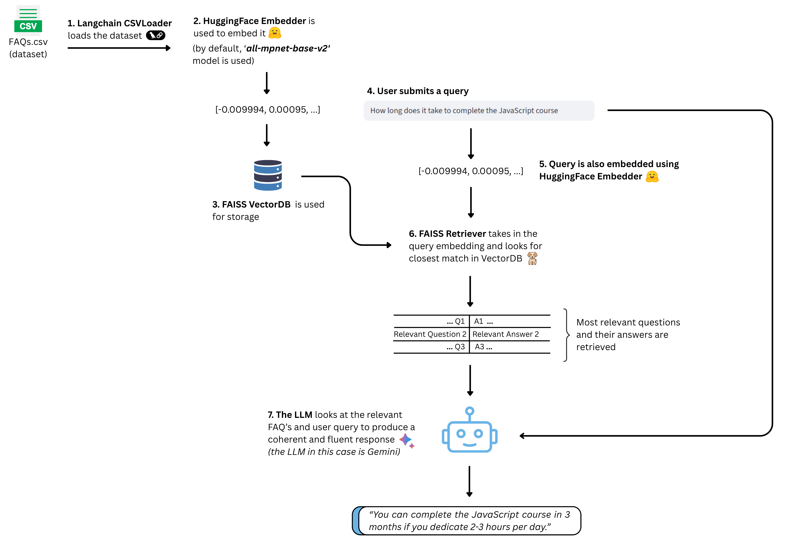

# AskVault 🧠  
Turn your FAQ database into an intelligent AI assistant.

AskVault is a Q&A chatbot built using LangChain that accurately answers questions by retrieving relevant context from your own CSV knowledge base. This eliminates  hallucinations and thus you get grounded, reliable answers.

This project is live and accessible at [askvault.streamlit.app](https://askvault.streamlit.app/)


## 🧑‍💻 How to Run Locally

```
git clone https://github.com/harsh-c137/Ask-Vault.git

cd Ask-Vault
```
Get your Gemini API key here: https://aistudio.google.com/app/apikey

Then create a `.streamlit` folder in the root directory

Inside it, create a file named `secrets.toml` and store your API key in the following format:

```
GEMINI_API_KEY="your-api-key-here"
```

Finally, install the dependencies and launch the app:

```
pip install -r requirements.txt

streamlit run app.py
```

Alternatively, you can run just the backend on your command line by using
```
python langchain_helper.py
```

##  How to Use Your Own CSV

- Create a CSV file with two columns: `prompt` and `response`
- Alternatively you can donwload and modify the one [created by codebasics](https://github.com/harsh-c137/Ask-Vault/blob/main/codebasics_faqs.csv)
- Upload your CSV via the UI and click on `Create Knowledgebase` button
- Please note that it takes a minute or two for your csv to be embedded and loaded into the FAISS VectorDB

## 🔍 What problem does this project solve?

Organizations like EdTech platforms, e-commerce sites, and support teams maintain huge FAQ databases. But feeding all of that to ChatGPT or a generic chatbot leads to hallucinations when the model lacks context.

**AskVault** solves this using:
- A vector database (FAISS) to store and search your Q&A efficiently
- HuggingFace embeddings for semantic similarity
- Gemini LLM for accurate and honest answers

Only the most relevant Q&As are passed to the LLM, making it both scalable and trustworthy.

## ⚙️ Tech Stack

- Python
- LangChain
- [HuggingFace Embeddings](https://huggingface.co/sentence-transformers/all-mpnet-base-v2)
- Streamlit (UI)
- FAISS (Vector DB)
- Gemini (LLM via Google Generative AI)

## 🧩 Architecture


## 💡 Common Questions
**Why FAISS VectorDB?**

It uses `IndexFlatL2` as its search algorithm when retrieving text. It performs exhaustive brute-force nearest neighbor search using Euclidean distance (aka L2 distance as the name suggests). It’s slower for massive datasets, but ensures exact results for small-to-medium knowledge bases.

**What if the answer isn't in the knowledge base?**

The model will say so; no hallucinations whatsoever. You can route fallback to a human if needed.

**Why this HuggingFace model?**

`all-mpnet-base-v2` is LangChain’s default. You can swap it later if needed.

## 🚀 Future Plans
- Switch to more scalable vector DBs (like Milvus or Pinecone)
- Add API support
- Support Excel, PDF, or unstructured docs
- UI polish and themes
- Enable user-level multi-tenancy

## 🤝 Let's Collaborate
- If you like AskVault and want to build your own AI-powered tool, feel free to connect with me on [LinkedIn](https://www.linkedin.com/in/harsh-deshpande-v1/) :)
